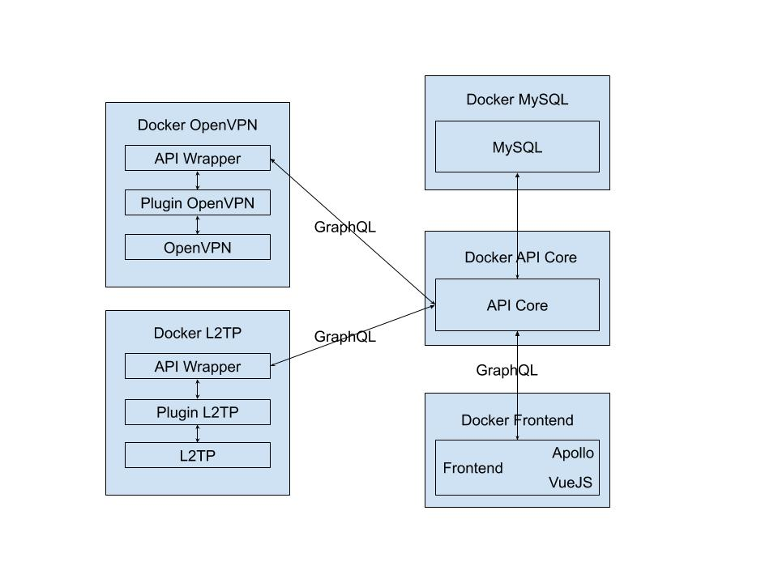

# Laravel VPN Admin

## Software Stack
* Docker
* Laravel/Symfony
* VueJS
* OpenVPN
* L2TP

## Technical requirements
* Required to create a modular structure of containers that would work independently from root server
* It should be composition of Docker containers which possible to run on popular OS
* OAuth2 authorization support
* It should be pure API server with GraphQL
* Groups of users
* Should be possible to create multiple VPN servers with different groups of users
* LDAP support
* Ability to generate SSL certificates for different servers
* Monitoring and statistics of usage
* Containers with VPN servers should self announced on API server
* Self testing of everything on build stage

## Contributors
### Back-end 
* [EvilFreelancer](https://github.com/EvilFreelancer)
* [Nejc aka SilverEngine](https://github.com/SilverEngineTeam)
* [Nejc aka SilverEngine](https://github.com/SilverEngineTeam)
* [Dinozor](https://github.com/Dinozor)
### Front-end
* [Faqqy](https://github.com/Faqqy)
### Other & Testers
* [Ilya Bakhlin](https://github.com/ilyabakhlin)
* [Дмитрий a.k.a Compolomus](https://github.com/Compolomus)
* [Artur](https://github.com/astralo)
